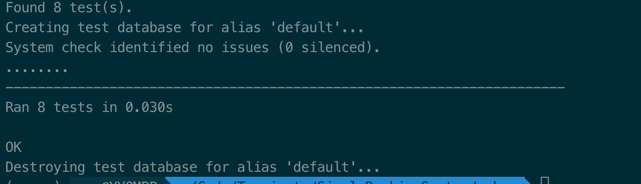

# 简单银行系统

###题目描述
```
-----------------
Develop a Simple Banking System  

Features
Users can create a new bank account with a name and starting balance
Users can deposit money to their accounts
Users can withdraw money from their accounts
Users are not allowed to overdraft their accounts
Users can transfer money to other accounts in the same banking system
Save and load system state to CSV

Expectations
- Use any programming language of your choice
- Provide steps to set up and run your project
- No UI is needed
- Remember the KISS principle
- High code quality
- Good test coverage
```

- 中文
```
-----------------
开发一个简单的银行系统

功能
用户可以创建一个新的银行账户，并指定账户名称和起始余额
用户可以将钱存入自己的账户
用户可以从自己的账户中提取资金
用户不得透支自己的账户
用户可以将钱转入同一银行系统中的其他账户
将系统状态保存并加载到 CSV

期望
- 使用您选择的任何编程语言
- 提供设置和运行项目的步骤
- 无需 UI
- 记住 KISS 原则
- 高代码质量
- 良好的测试覆盖率
```

## 安装与使用
### 1. 环境准备
确保系统已安装以下依赖：
- Python 3.10+

### 2. 安装依赖
```bash
    pip install -r requirements.txt
```

### 3. 运行数据库迁移
```bash
    python manage.py makemigrations
    python manage.py migrate
```

### 4. 启动服务
```bash
    python manage.py runserver
```

### 5. 单元测试
```bash
    python manage.py test bank
```


## 功能说明
- 查询账户列表：```curl --location 'http://127.0.0.1:8000/bank/accounts/'```
- 创建银行账户：```curl --location 'http://127.0.0.1:8000/bank/accounts/create/' \
--header 'Content-Type: application/json' \
--data '{"account_name":"tester01", "initial_balance": "99.99"}'```
- 将钱存入自己的账户：```curl --location 'http://127.0.0.1:8000/bank/accounts/1/deposit/' \
--header 'Content-Type: application/json' \
--data '{"amount": "1.1"}'```
- 从自己的账户中提取资金: ```curl --location 'http://127.0.0.1:8000/bank/accounts/1/withdraw/' \
--header 'Content-Type: application/json' \
--data '{"amount":"1.1"}'```
- 将钱转入同一银行系统中的其他账户: ```curl --location 'http://127.0.0.1:8000/bank/accounts/1/transfer/' \
--header 'Content-Type: application/json' \
--data '{"to_account_id": 2, "amount": 1.1}'```
- 将系统数据保存到csv并下载：```curl --location 'http://127.0.0.1:8000/bank/save_csv/'```
- 支持将本地csv文件上传到系统并覆盖：```curl --location 'http://127.0.0.1:8000/bank/load_csv/' \
--form 'csv_file=@"/Users/Downloads/bank_accounts.csv"'```


## 单元测试结果：
